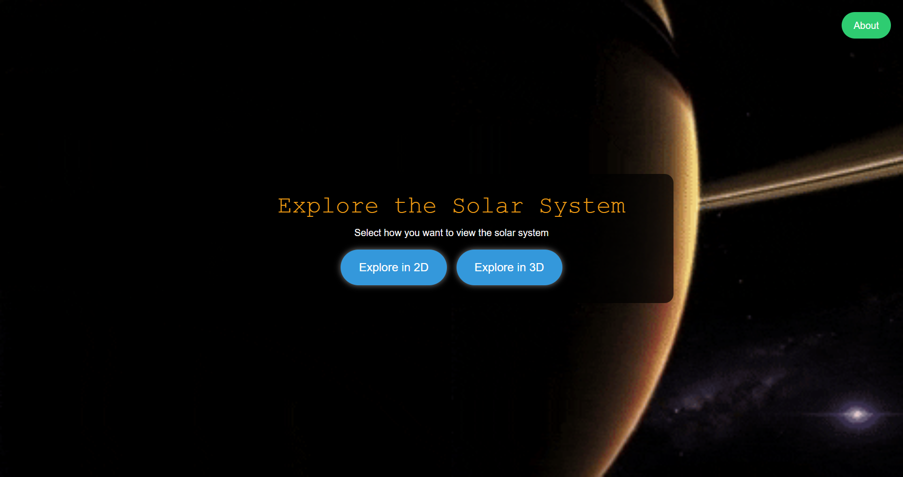
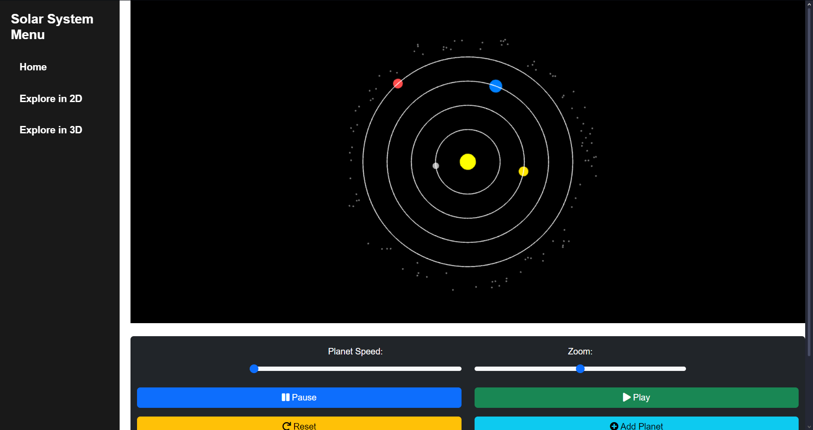
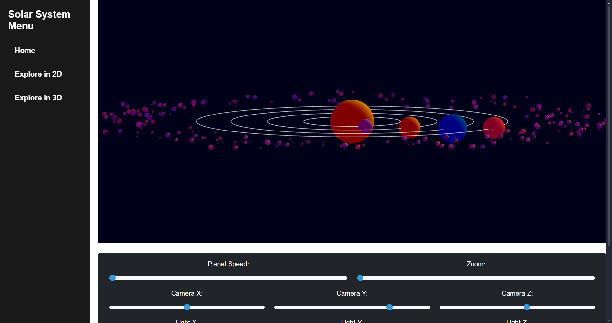

# GRAFKOM - ETS

## Anggota Kelompok:
- 5025221001 - Jericho Nathanael Chrisnanta
- 5025221049 - Yanuar Eka Pramudya
- 5025221260 - Muhammad Bimatara Indianto

## Judul Proyek:
**Simulasi Gerak Tata Surya**

## Fitur Simulasi:
- Menambah kecepatan rotasi planet.
- Mengurangi kecepatan rotasi planet.
- Menghentikan rotasi planet.
- Melanjutkan rotasi planet.
- Mereset semua state planet.
- Menambahkan planet baru.
- Menghapus planet.
- Menambahkan Sabuk Asteroid.
- Menghapus Sabuk Asteroid.
- Mengatur kamera pada sumbu X dan Y.
- Mengubah arah cahaya pada sumbu X, Y, dan Z.

## Overview Tampilan :
- Tampilan Menu

- Tampilan 2 Dimensi

- Tampilan 3 Dimensi

---